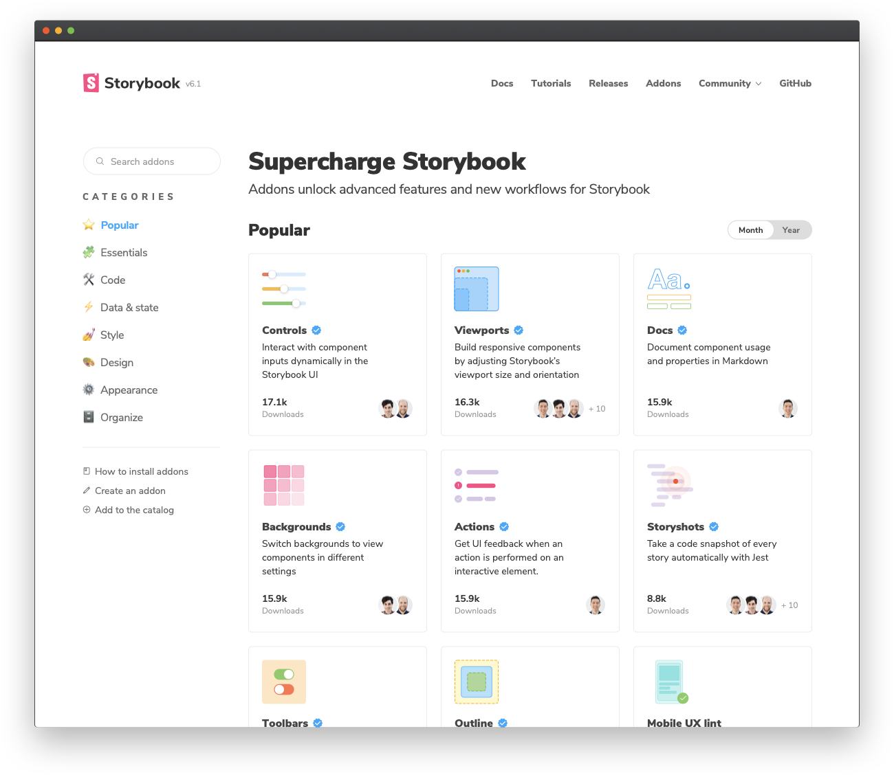

The [Addon Catalog](https://storybook.js.org/addons) is the home of all Storybook addons. It’s where we showcase your addons and how developers discover new ones. Let's prepare your addon for release, package it up, and publish it to the catalog.



## Preparing your addon for release

Storybook addons, like most packages in the JavaScript ecosystem, are distributed via npm. However, they have certain criteria:

1. Have a dist directory containing transpiled ES5 code
2. A `preset.js` file at the root level, written as an ES5 module
3. A `package.json` file that declares:
   - Peer-dependencies
   - Module related info
   - Catalog metadata

The Addon Kit handles most of this for us. We just need to ensure that we supply the appropriate metadata.

## Module Metadata

The first category is module related metadata. This includes the main entry point for the module and which files to include when you publish the addon. And all peer-dependencies of the addon. For example, react, react-dom and all Storybook related APIs.

```json:title=package.json
{
  ...
  "main": "dist/preset.js",
  "files": [
    "dist/**/*",
    "README.md",
    "*.js"
  ],
  "peerDependencies": {
    "@storybook/addons": "^6.1.14",
    "@storybook/api": "^6.1.14",
    "@storybook/components": "^6.1.14",
    "@storybook/core-events": "^6.1.14",
    "@storybook/theming": "^6.1.14",
    "react": "^16.8.0 || ^17.0.0",
    "react-dom": "^16.8.0 || ^17.0.0"
  },
  ...
}
```

#### Why peer-dependencies?

Let’s say you are building a form library that works with React. If you include React as a dependency then the React code will be packaged along with your library. Your users already install React within their codebase. If that happens to be a different version then, it’ll cause their app to break. It’s the same idea here.

## Catalog Metadata

Along with the module related info you also need to specify some metadata for the Storybook Addon Catalog.


Some of this info is pre-configured by the Addon Kit. Things like a display name, icon or frameworks compatibility is specified via the storybook property. For the complete specification of the metadata API check out the [Addon metadata documentation](https://storybook.js.org/docs/react/addons/addon-catalog/#addon-metadata).

```json:title=package.json
{
  ...
  "name": "my-storybook-addon",
  "version": "1.0.0",
  "description": "My first storybook addon",
  "author": "Your Name",
  "storybook": {
    "displayName": "My Storybook Addon",
    "unsupportedFrameworks": ["react-native"],
    "icon": "https://yoursite.com/link-to-your-icon.png"
  },
  "keywords": ["storybook-addons", "appearance", "style", "css", "layout", "debug"]
  ...
}
```

The keywords property here maps to catalog tags. For example, the storybook-addons tag ensures that your addon will get into the catalog. And appearance is a top-level category. The rest help with searchability of your addon.

## Publishing to NPM

The last step is to actually publish the addon. The Addon Kit comes pre-configured with [Auto](https://github.com/intuit/auto) for release management. It generates a changelog and pushes it to both GitHub and npm. Therefore, you need to configure access to both.

1. Authenticate using [npm adduser](https://docs.npmjs.com/cli/adduser.html)
2. Create an [access token](https://docs.npmjs.com/creating-and-viewing-access-tokens#creating-access-tokens). You’ll need a token with both _Read and Publish_ permissions.
3. Similarly, generate a [Github token](https://github.com/settings/tokens). This token will need the repo scope.
4. Create a `.env` file at the root of your project and add both these tokens to it:

```bash
GH_TOKEN=value_you_just_got_from_github
NPM_TOKEN=value_you_just_got_from_npm
```

Next, **create labels on GitHub**. You’ll use these labels in the future when making changes to the package.

```bash
npx auto create-labels
```

If you check on GitHub, you’ll now see a set of labels that Auto would like you to use. Use these to tag future pull requests.

Finally, creating a release

```bash
npm run release
```

Which will:

- Build and package the addon code
- Bump the version
- Push a release to GitHub and npm
- Push a changelog to GitHub

There you have it! We’ve successfully published our package to npm and released our first Storybook Addon. There may be a delay in your addon showing up in the catalog because it crawls npm. If your addon isn’t showing up, please file an issue on the catalog repo.
